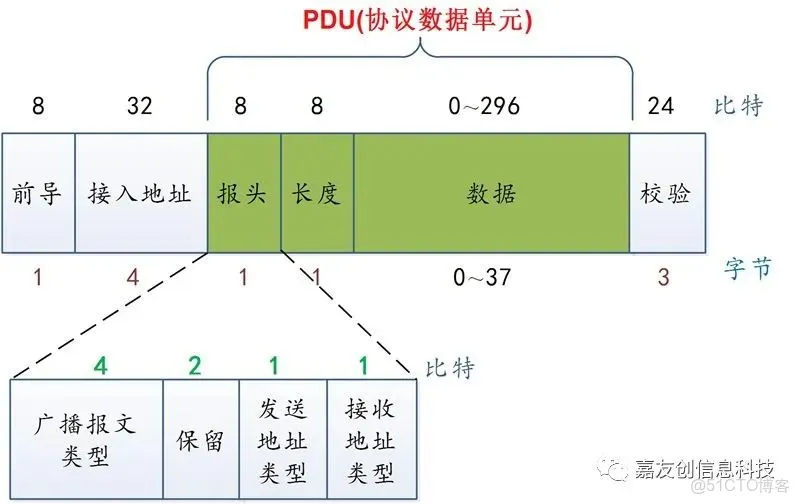

# python脚本说明

python脚本用于验证相关算法的正确性，具体内容简介如下：

- ctc_sim：该文件夹下为CTC算法的模拟
  - bluebee：通过BLE调制zigbee信息，核心是构造特定负载，脚本zigbee_mod_ble.py用于生成负载的映射表
  - patternbee：在BLE侧利用zigbee符号的模式特征来解调zigbee信号，脚本dual_analyze.py集成了正常zigbee信号分析和利用patternbee分析zigbee符号的功能
  - ble_analyze.py：标准的分析BLE信号脚本，数据源为IQ基带信号
  - generate_ble_iq_from_bits_txt.py：将指定内容调制为BLE信号，目前固定调制在广播信道上
  - std_zigbee：zigbee_mod将名为data_bits.txt的原始二进制字符调制为标准zigbee符号，由zigbee_analyze分析。
    - zigbee_rx可以控制hackrf等SDR实时接受并分析zigbee信号
    - generate_zigbee_iq_30_71M能够生成给e310使用的dma数据，使其能够发射zigbee信号
- std_ble：该文件下为标准BLE物理层的部分实现
  - ble_rx及相关脚本通过gnuradio库控制hackrf实现BLE广播数据检测
  - generate_ble_iq_30_72M.py生成BLE包IQ波形

使用的脚本参考了：[auto_test_tool](https://github.com/nbtool/auto_test_tool/tree/master)中的BLE相关内容。

generate_ble_iq_30_72M.py用于生成BLE广播包响相应的IQ数据波形，可以生成37,38,39信道上的BLE广播信号波形，该波形对应的采样率为ad9363上tx链路常用的30.72MHz。数组格式为C语言风格，且为了适配dma双通道的格式，每个数据会重复两次，高16位为Q路数据，低16位为I路数据，通过替换axi_dac_core.c中的数组来使用其他生成的数据，对应command.c中的外部变量声明也要做相应修改。

## BLE数据包结构

以最简单的一个广播数据包为例，BLE数据包必须具有以下结构：

前导码(Preamble) $\rightarrow$ 接入地址(Access Address) $\rightarrow$ 链路层协议数据单元(PDU) $\rightarrow$ 24位CRC校验码



### 前导码

固定格式：0xAA（10101010），视接入地址最低位可能会变为0x55（01010101）

> 接入地址最低位为1时，因为BLE采用小端传输和小端序，所以发送时接入地址发出的第一个比特就是这个1，为了让前导码和这个最低位之间形成跳变，就要求前导码最后发送出去的数据为0,考虑到前导码也采用了小端传输，此时应该使用0x55.

用于时钟同步和边界检测，不参与白化和CRC

### 接入地址

广播帧使用统一接入地址：0x8E89BED6

- 最低位为0,所以前导码使用0xAA
- 由于采用小端序，实际在代码中会交换字节顺序；
- 不参与白化和CRC校验

### 链路层协议数据单元

包含一个Header，MAC地址以及负载

Header为16位长，控制设备之间的通信状态。

广播数据包和连接态数据包的header含义不同，此处仅列举广播数据包的规定：

header第一个字节的bits[3:0]表示广播报文类型，bits[5:4]是两位保留位，新版本蓝牙用于Chsel，最后bit[6]是TxAdd,最高位bit[7]是RxAdd

|二进制值|类型名称|含义|用途|
|:---:|:---:|:---:|:---:|
|0000|ADV_IND|可连接的非定向广播|表示设备可以被连接，也允许被扫描|
|0001|ADV_DIRECT_IND|可连接的定向广播|针对特定设备发起的快速连接请求，通常不包含额外数据|
|0010|ADV_NONCONN_IND|不可连接的非定向广播|用于发送数据（如信标），不允许连接，也不响应扫描请求|
|0011|SCAN_REQ|扫描请求|由扫描者（如手机）发送给广播者，请求获取更多数据|
|0100|SCAN_RSP|扫描响应|由广播者回复给扫描者，包含补充的广播数据（如完整设备名）|
|0101|CONNECT_IND|连接请求|由发起者（如手机）发送，请求与广播者建立连接，包含连接参数|
|0110|ADV_SCAN_IND|可扫描的非定向广播|允许被扫描，不允许直接连接|

其他编码有拓展功能，此处不再详细描述

- TxAdd为0时表示广播包中的发送者MAC地址为厂商烧录，全球唯一，不可修改；为1时表示地址为随机地址，是软件生成的
- RxAdd为0时表示广播包中的目标设备MAC地址为公共地址，为1时表示目标是随机地址
- header的第二个字节为后面pdu的长度，广播数据包的长度不能超过32字节
- MAC地址固定6字节，在开启隐私功能后会不断切换，对于广播包则是固定的

综上，我们的报头为0x42,2对应ADV_NONCONN_IND，4表示将TxAdd置1

BLE的广播数据采用LTV结构(length-type-value)，先是一个字节表示长度（不包含自己），一个字节表示类型，一个字节表示数值。

常见的广播类型：

|十六进制值|名称|含义|
|:---:|:---|:---:|
|0x01|Flags|广播标志，定义设备的发现模式|
|0x02|Incomplete List of 16-bit Service UUIDs|不完整的16位服务UUID列表|
|0x03|Complete List of 16-bit Service UUIDs|完整的16位服务UUID列表|
|0x08|Shortened Local Name|缩略设备名称|
|0x09|Complete Local Name|完整设备名称|
|0x0A|Tx Power Level|发射功率|
|0xFF|Manufacturer Specific Data|厂商自定义数据|

广播标志主要有以下内容：

- bit0：LE有限发现模式，表示临时可见，通常用于设备刚上电配对时，不会长时间停留。
- bit1：LE通用发现模式，表示持续可见，设备始终在线，随时等待被扫描和连接
- bit2：不支持BR/EDR,置1表示仅支持BLE
- bit3：同一设备控制器能力，置1表示该设备控制器层同时支持LE和BR/EDR
- bit4：同一设备主机能力，置1表示该设备主机层同时支持LE和BR/EDR
- 其他位为保留位

一般将包含flag信息的adv内容设置为：0x020106，0x02为长度，0x01表示flags类型，0x06表示LE通用发现模式，不支持BR

### 24-CRC计算

```python
crc = 0xaaaaaa  # 广播信道初始种子，0xaaaaaa为0x555555的翻转
for b in pdu:
    for i in range(8):
        bit = (b >> i) & 1
        crc_lsb = crc & 1
        crc >>= 1
        if bit ^ crc_lsb:
            # 0xDA6000 是 BLE 多项式 0x00065B 翻转后的 LSB First 异或值
            crc ^= 0xda6000

crc_bytes = bytes([crc & 0xFF, (crc >> 8) & 0xFF, (crc >> 16) & 0xFF])
```
翻转种子的操作取决于pdu是否翻转，CRC计算是将初始值与位序翻转后的负载进行异或，最后计算得到的crc要按照小端序接到负载后面。

### 白化

白化用于将连续的0或1打断，本质上是生成一个随机序列与负载异或，只要发送端和接收端生成的序列相同，两次异或就能恢复出原始数据。

白化的实现基于一个7位的线性反馈移位寄存器（LFSR）实现。

常见的白化算法基于斐波那契LFSR,取寄存器中的第零和第四位异或生成寄存器的新数据位，然后将最低位作为输出与负载异或；此处使用的是伽罗瓦LFSR,仅将最高位作为全局反馈源，直接通过全局异或更新状态。

斐波那契抽头系数正好对应伽罗瓦抽头系数的倒序，原本的抽头点7,4,0变为7,3,1，原始序列与伽罗瓦PN序列的异或相当于斐波那契PN序列与原始序列异或后的平移。

伽罗瓦LFSR的好处是只需要一个异或门即可实现，省去了位提取和拼接，在实际电路中更具效率。

```python
# Swap bits of a 8-bit value
def bt_swap_bits(value):
    return (value * 0x0202020202 & 0x010884422010) % 1023

# (De)Whiten data based on BLE channel
def bt_dewhitening(data, channel):
    ret = []
    lfsr = bt_swap_bits(channel) | 2
    
    if not data:
        return ret
    first_element = data[0]
    if isinstance(first_element, str):
        # 假设所有元素都是字符串
        processed_data = [bt_swap_bits(ord(d[:1])) for d in data]
    elif isinstance(first_element, int):
        # 假设所有元素都是整数
        processed_data = [bt_swap_bits(d) for d in data]
    else:
        raise ValueError("输入列表中的元素必须是字符串或整数")

    for d in processed_data:
        for i in [128, 64, 32, 16, 8, 4, 2, 1]:
            if lfsr & 0x80:
                lfsr ^= 0x11
                d ^= i

            lfsr <<= 1
            i >>= 1
        ret.append(bt_swap_bits(d))

    return ret
```

## BLE调制方法

### GFSK流程

先将原始的[0,1]序列转换为[-1,+1]序列，表示负向的频偏和正向的频偏，然后生成高斯滤波器核，对序列做卷积，然后利用相位积分的方法得到具体相位，从而得到具体的IQ数据。

之所以要用高斯滤波，是为了让原本符号间的瞬间跳变变为平滑的变化，压缩频谱，减少带外辐射，同时减少码间串扰，其本质仍是加权平均。相较于其他滤波器，高斯滤波器有如下优点：

- 高斯函数的傅里叶变换还是高斯函数
  - 巴特沃斯滤波：频域平坦，时域拖尾差
  - 升余弦：旁瓣高，带外差
  - 切比雪夫：波动大，非线性差
- 高斯脉冲在全时间轴上任意阶导数都连续，所以GFSK信号没有相位突变，恒包络
- 高斯函数满足时频不确定原理下界，用时域展宽换频谱压缩的效率最高

高斯滤波的缺点：

- 频谱效率上限固定：1bit/符号，无法高阶调制，提速只能靠提高符号速率
- 抗多径衰落能力弱于差分相位调制
- 同信噪比下，误码性能略逊于相干调制

### 高斯滤波器

理想高斯滤波器的频率响应：

$$
H(f) = \exp{(- \frac{ln 2}{2}(\frac{f}{B})^2)}
$$

- f：频率
- B：滤波器3dB截止带宽（功率下降一半的频率点）
- ln 2 $\approx{0.6931}$：归一化系数，保证f=B时幅度衰减3dB

时域响应（脚本中实际使用的卷积核）：

$$
g(t) = \sqrt{\frac{2\pi}{ln2}}B\exp{(-\frac{2\pi^2}{ln 2}B^2t^2)}
$$

- t：时间
- g(t)：高斯脉冲波形

GFSK关键参数：带宽时间积和调制指数

（1）带宽时间积BT

BT = B * T

- B：3dB截止带宽
- T：符号周期（1M PHY下，T=1us;2M PHY下，T=0.5us）

BT越小，滤波器越窄，时域脉冲拖尾越长，会加剧码间串扰，提高误码率；BT越大，滤波器越宽，频谱扩散越严重，带外干扰变大。BLE标准下BT强制为0.5

（2）调制指数h（控制不同符号的频率间隔）

$$
h = 2\Delta f * T
$$

- $\Delta f$：峰值频偏（符号相对载波中心频率的最大偏移量）
- T：符号周期长度

BLE规范h在0.45到0.55之间，标称为0.5,此时等价于最小频移键控，两个频点的间隔为$\frac{1}{2T}$，是频谱效率的极限最优

### 脚本内容部分说明

先将原始符号序列上采样768倍，之后除以25降采样到30.72,对应ad9363的TX采样率。

```python
def get_gaussian_filter(BT, sps, span=4):
    t = np.arange(-span*sps/2, span*sps/2) / sps
    alpha = np.sqrt(np.log(2) / 2) / BT
    h = (np.sqrt(np.pi) / alpha) * np.exp(- (np.pi * t / alpha)**2)
    return h / np.sum(h)

# 该函数中的span表示截断长度，决定了滤波器在时域上的“长度”
# 这里设置为4,表示冲激响应覆盖4个符号的时间长度
# span越大，精度越高，但计算负担越大
# 除以sps得到归一化时间，此时t表示过去了多少个符号周期的时间
```

- 高斯滤波后的上采样符号序列每个元素描述的是该时刻频率偏移的强度值，而想要得到最终的IQ波形，我们需要得到的是每个采样时刻的相位。
- 相位是频率的积分，在连续系统中我们可以把相位表示为：

$$
\phi(t) = 2\pi\int_0^t f(\tau) d\tau
$$

- 这里的 $f(\tau)$ 就是频率偏移量， $2\pi d\tau$ 就是两个采样点之间的相位步进
- 重点在于相位步进的计算，要考虑调制指数h
  - BLE规定h=0.5
  - h表示的是发送两种符号时，信号在一个符号周期内的相位发生的变化，我们这里用1M的符号率（1个符号1us），250kHz的频偏得到h为0.5
  - 从h的公式可以得到(T为单个符号时长)：
  - $h = 2\Delta f * T = 2 \Delta \omega T / 2\pi = \Delta \omega T / \pi$
  - 所以角频率增量为：
    - $\Delta \omega = \pi * h / T = \pi / 2T$
  - 代码中因为使用了上采样，所以相位的步进还要除以上采样的倍数
- 最后以离散形式的积分计算出相位，从而得到IQ信号
- 在接收机的角度，当符号为正频偏时，IQ数据的向量就会逆时针旋转，最终相位差大于0；
- 为什么h要设置为0.5？
  - 当h为0.5时，表示符号的相位差分为45度（前后两个IQ矢量之间的相位差为45度）
  - 1.最大的抗噪容限：符号1和0此时的相位差距为90度，正好正交，仅需判断虚部正负即可区分
  - 2.频谱效率与功率效率的平衡：频偏太小导致信号能量太集中，接收机不好从噪声中分离信号；频偏太大会占用更宽的频谱干扰其他信道。

接收端的设计借用了gnuradio自带的GFSK Demod,仅需将经过低通滤波处理的数据通过该模块处理，再模拟物理端的白化和CRC检查即可。帧分析在app_frame.py中实现

## ZigBee数据包结构与调制方法

本仓库中的 `ctc_sim/std_zigbee` 主要用于生成和接收标准 IEEE 802.15.4 2.4GHz ZigBee PHY 信号。ZigBee 2.4GHz 物理层采用 DSSS + O-QPSK 调制，数据速率为250kbps，chip速率为2Mchip/s。

### ZigBee 2.4GHz信道

ZigBee 2.4GHz共有16个信道，编号为11到26，信道间隔为5MHz。代码中默认使用11信道：

$$
f_c = 2405MHz + 5MHz \times (channel - 11)
$$

对应 `gr_zigbee.py` 中的参数：

```python
self.zigbee_channel = 11
self.zigbee_base_freq = 2405e6
self.zigbee_channel_spacing = 5e6
self.freq = zigbee_base_freq + (zigbee_channel_spacing * (zigbee_channel - 11))
```

### PHY帧结构

标准802.15.4 PHY帧结构为：

前导码(Preamble) $\rightarrow$ SFD $\rightarrow$ PHR(length) $\rightarrow$ MAC payload $\rightarrow$ FCS

本代码中使用的帧格式为：

```text
0x00 0x00 0x00 0x00 | 0xA7 | length | payload | FCS_L | FCS_H
```

- 前导码：4字节 `0x00`，用于同步和帧起始检测。
- SFD：固定为 `0xA7`，用于标记前导码结束。
- length：MAC payload和FCS的总长度，代码中为 `len(payload) + 2`。
- FCS：使用CRC16，低字节在前。

CRC计算在 `zigbee_mod.py` 和 `zigbee_rx.py` 中使用同一套 LSB-first CRC16：

```python
def crc16_ccitt(data, init=0x0000):
    crc = init
    for value in data:
        crc ^= value
        for _ in range(8):
            if crc & 1:
                crc = (crc >> 1) ^ 0x8408
            else:
                crc >>= 1
    return crc & 0xFFFF
```

### DSSS扩频

ZigBee不是直接把每个bit调制到载波上，而是先将每4个bit组成一个symbol，然后查表映射为32个chip。这样原始250kbps数据经过扩频后变为2Mchip/s：

$$
250kbps \times \frac{32chips}{4bits} = 2Mchip/s
$$

代码中的 `CHIP_MAP` 保存了16个4-bit symbol对应的32-chip序列：

```python
CHIP_MAP = [
    "11011001110000110101001000101110",  # 0x0
    "11101101100111000011010100100010",  # 0x1
    ...
]
```

发送端 `bits_to_chips()` 的核心流程是：

```python
for i in range(0, len(bit_str), 4):
    nibble = bit_str[i : i + 4]
    symbol = int(nibble, 2)
    chips.append(CHIP_MAP[symbol])
```

接收端则反过来，每32个chip与16个标准chip序列计算汉明距离，选择距离最小的symbol：

```python
for s, ref in enumerate(CHIP_MAP):
    d = sum(1 for a, b in zip(chunk, ref) if a != b)
    if d < best_d:
        best_d, best_s = d, s
```

这使接收端能容忍少量chip错误，只要正确symbol的汉明距离仍然最小，就能恢复对应4-bit symbol。

### O-QPSK与半正弦成形

DSSS输出的是chip序列，实际2.4GHz PHY使用半正弦成形的 O-QPSK。其基本流程为：

1. 将chip bit映射为 $-1/+1$。
2. 偶数chip进入I路，奇数chip进入Q路。
3. I/Q两路分别经过半正弦脉冲成形。
4. Q路相对I路延迟半个chip，避免I/Q同时跳变。

代码中 `oqpsk_modulate()` 的实现为：

```python
chips = [1.0 if b == "1" else -1.0 for b in chip_bits]
i_chips = chips[0::2]
q_chips = chips[1::2]

pulse = half_sine_pulse(samples_per_chip)
...
delay = samples_per_chip // 2
q_wave = ([0.0] * delay) + q_wave
```

半正弦脉冲为：

$$
p[n] = \sin\left(\pi \frac{n + 0.5}{N}\right)
$$

其中 $N$ 为每个chip的采样点数。半正弦成形可以让相位变化更平滑，降低带外辐射，同时O-QPSK通过半chip偏移避免QPSK中180度相位跳变。

### 发送端实际代码路径

基础发送脚本为 `zigbee_mod.py`，流程如下：

```text
原始bit -> PHY帧 -> DSSS chips -> O-QPSK IQ -> zigbee_iq.txt
```

其中 `build_phy_frame()` 完成前导码、SFD、length和FCS拼接；`bits_to_chips()` 完成DSSS扩频；`oqpsk_modulate()` 完成O-QPSK调制。

实际用于硬件发送的是 `generate_zigbee_iq_30_72M.py`，流程略有不同：

```text
payload bytes -> PHY帧 -> DSSS chips -> 10MHz O-QPSK IQ -> FFT重采样到30.72MHz -> int16打包 -> C数组
```

这里先在10MHz下生成波形，因为10MHz对应2Mchip/s时每chip正好5个采样点，便于保持chip边界为整数采样点。之后通过FFT重采样到30.72MHz，比例为：

$$
\frac{30.72}{10} = \frac{384}{125}
$$

重采样之后再添加静默padding，避免FFT把padding边界当成周期信号的一部分产生额外频域伪影。最终数据被缩放到16位整数，并按硬件DMA格式打包：

```python
iq_uint32 = (q_uint16.astype(np.uint32) << 16) | i_uint16.astype(np.uint32)
iq_uint32_repeated = np.repeat(iq_uint32, 2)
```

即高16位为Q路，低16位为I路，并且每个采样重复两次以适配双通道DMA格式。

### 接收端实际代码路径

接收端分为GNU Radio实时链路和Python帧解析两部分。

`gr_zigbee.py` 负责从HackRF接收IQ并恢复chip判决：

```text
HackRF IQ -> 低通滤波 -> Costas loop -> I/Q拆分 -> 半正弦匹配滤波 -> 抽样 -> slicer -> packed chips -> ZMQ
```

关键参数为：

```python
sample_rate = 10e6
chip_rate = 2e6
demod_sps = int(sample_rate / chip_rate)  # 5 samples/chip
cutoff_freq = 2.5e6
```

I/Q两路均使用与发送端一致的半正弦脉冲作为匹配滤波器：

```python
self.pulse_taps = [
    numpy.sin(numpy.pi * (n + 0.5) / demod_sps) for n in range(demod_sps)
]
```

之后通过 `keep_m_in_n` 每chip保留一个采样点，再经过 `binary_slicer` 转为硬判决chip bit，并通过ZMQ发给 `zigbee_rx.py`。

`zigbee_rx.py` 负责将packed chip重新解析为帧：

```text
ZMQ bytes -> chips -> DSSS symbol判决 -> bits -> bytes -> preamble/SFD检测 -> FCS检查
```

帧检测时先查找 `CHIP_MAP[0]` 对应的前导码chip候选，再在候选附近窗口中恢复symbol和byte，最后调用 `find_preamble()` 检查4字节前导码和SFD。

通过FCS的包计入 `crc_ok_packets`，只检测到前导码但FCS失败的包计入 `preamble_only_packets`，输出中会同时显示这两个计数。

### 当前使用的优化手段

（1）GNU Radio侧尽量使用C++ block完成高速流处理

接收端的低通滤波、Costas loop、I/Q拆分、匹配滤波、抽样和二值判决都放在GNU Radio流图中执行，Python只处理已经判决后的chip bit，减少Python直接处理IQ采样的压力。

（2）ZMQ批量读取，避免实时链路堆积

`zigbee_rx.py` 中不再每轮只读取一条ZMQ消息，而是每轮最多读取200条已经到达的消息：

```python
def read_available(self, max_messages=200):
    messages = []
    if self.socket.poll(10) == 0:
        return messages
    while len(messages) < max_messages:
        try:
            messages.append(self.socket.recv(zmq.NOBLOCK))
        except zmq.Again:
            break
    return messages
```

这样可以在Python解码速度略慢时尽快清空ZMQ积压，同时仍按顺序拼接数据，不破坏连续chip流。

（3）限制缓冲区长度，避免内存持续增长

接收端只保留最近的chip数据：

```python
MAX_CHIPS = 9600
if len(chip_buf) > MAX_CHIPS:
    chip_buf = chip_buf[-MAX_CHIPS:]
```

这可以避免长时间运行时 `chip_buf` 无限制增长。代码还会在长时间没有有效检测时清空旧噪声缓冲：

```python
if zmq_msgs > 0 and time.time() - last_clear > 3.0:
    chip_buf = ""
```

（4）窗口化帧检测，减少全缓冲解码

当前 `zigbee_rx.py` 不对整个 `chip_buf` 做完整DSSS反扩频，而是先查找 `PREAMBLE_CHIPS` 候选，再只对候选附近的小窗口做symbol恢复：

```python
PREAMBLE_SYMBOLS = PREAMBLE_BYTES * 2
FRAME_SYMBOLS = KNOWN_FRAME_LEN * 2
WINDOW_SYMBOLS = FRAME_SYMBOLS + PREAMBLE_SYMBOLS
```

窗口化检测不强制候选chip位置一定是帧起点，而是在窗口内继续查找完整的4字节前导码和SFD。这样相比直接截取固定帧起点更稳健，同时减少每轮需要计算汉明距离的chip数量。

（5）发送端重采样顺序优化

`generate_zigbee_iq_30_72M.py` 先在10MHz生成整数chip边界的O-QPSK波形，再FFT重采样到30.72MHz，最后添加padding。这样既保证了基带波形的构造简单可靠，也避免padding参与FFT重采样产生边界伪影。

